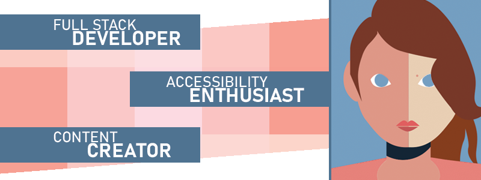
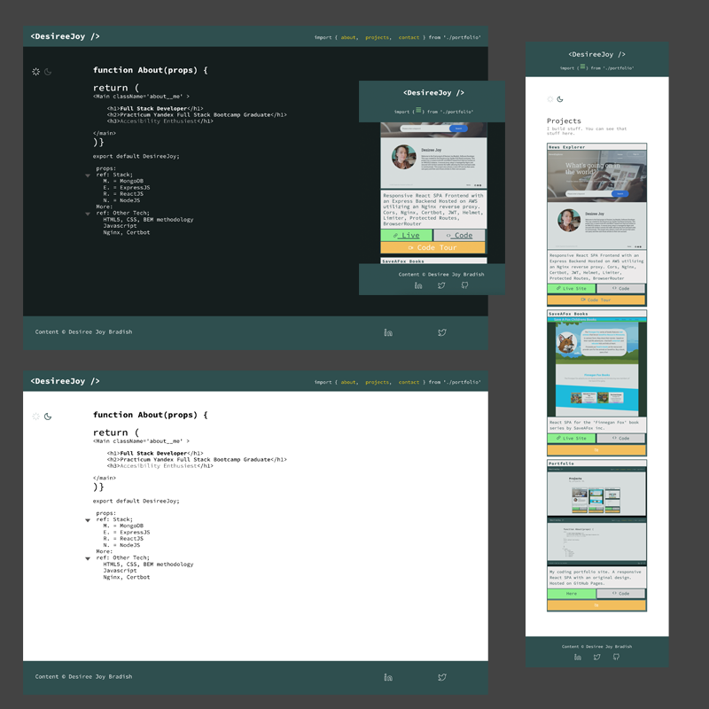
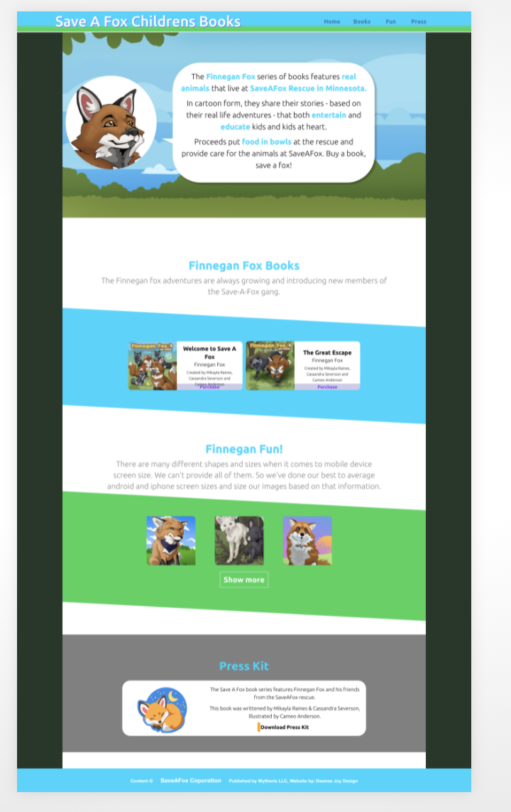
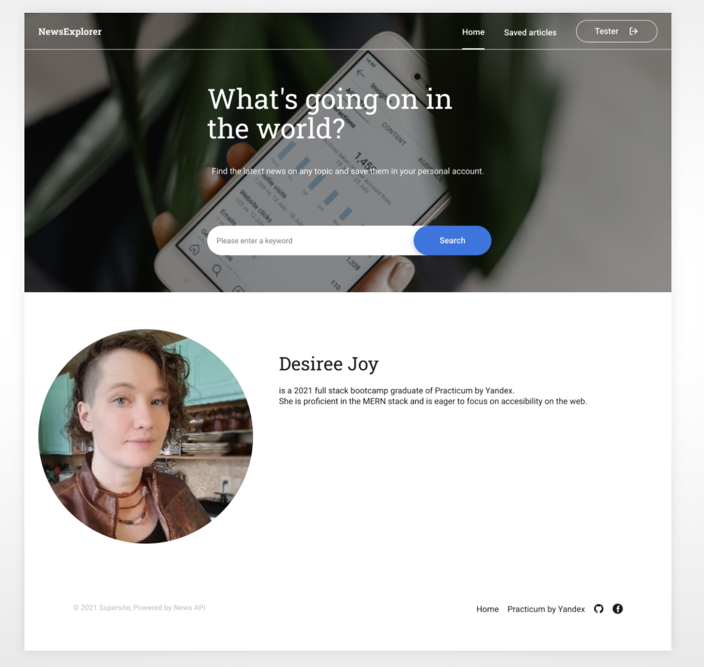

	
		

	

  &nbsp;&nbsp;
   &nbsp;&nbsp;
     

	
Hi there 👋 I'm Desireé Joy. (She/Her)
	
🔭 I’m currently learning
	<ul>
	<li>React Native</li>
	<li>NextJS</li>
	</ul>
&nbsp;&nbsp;

👥 I’m looking to collaborate on ...
	<ul><li>Projects related to Accessibility</li>
		<li>Open Source</li>
		<li>Augmented Reality</li>
	</ul>
	

	
<h1>Featured Projects</h1>

[React Portfolio](https://desireejoy.github.io/DesireeJoy_Portfolio/) | [Code](https://github.com/DesireeJoy/DesireeJoy_Portfolio)

React Based Portfolio Site for Desiree Joy Bradish

[Finnegan Fox Books](https://desireejoy.github.io/SaveAFox-temp/) | [Code](https://github.com/DesireeJoy/SaveAFox-temp)

React based responsive design for the 'Finnegan Fox' book series by SaveAFox inc.

[News Explorer](https://djbnews.students.nomoreparties.sbs/) | [Code](https://github.com/DesireeJoy/news-explorer-full) | 
	[YouTube Code Tour](https://www.youtube.com/watch?v=FTztV9q4i1c)

Full (M.E.R.N.) stack responsive SPA that utilizes a public news search API and a private API, created by me, for logging in/out and saving articles. It utilizes a NGINX reverse proxy setup to keep both hosted at the same location and Certbot for security.
	

	

	    
	  
	  
	  

	  
	  
	  
	  

